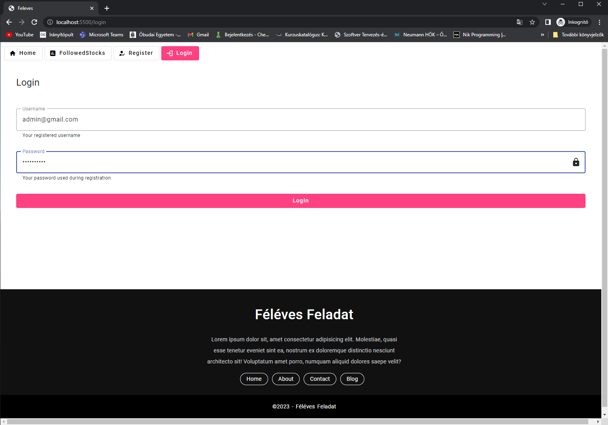
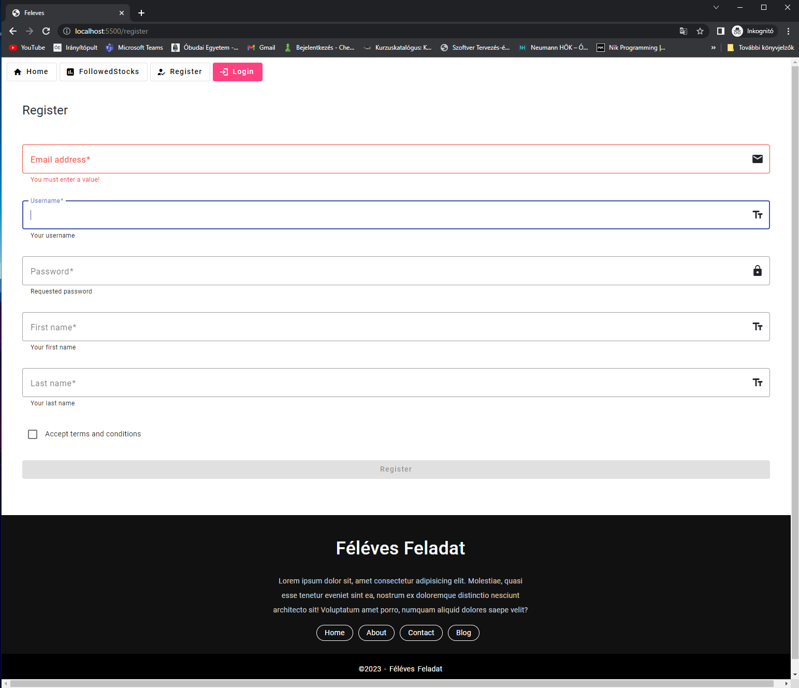
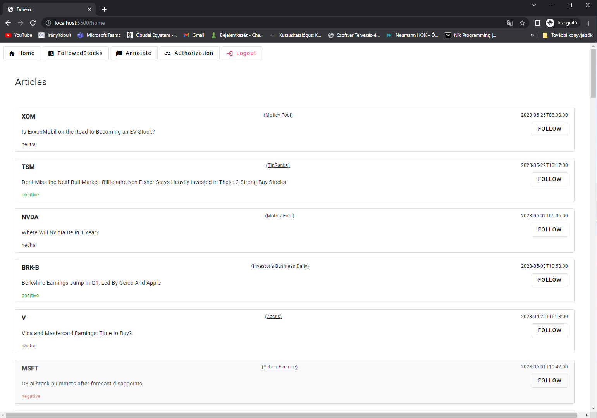
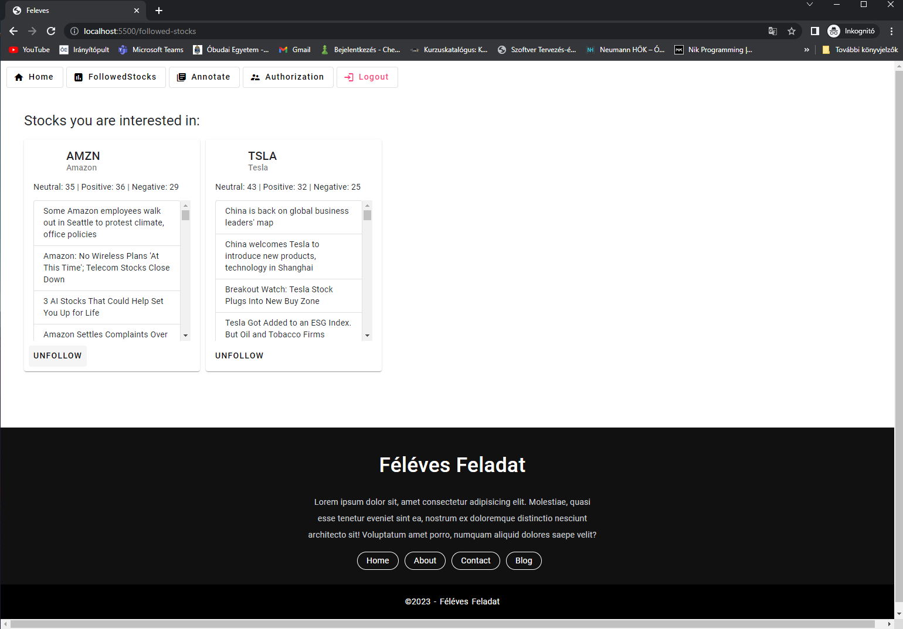
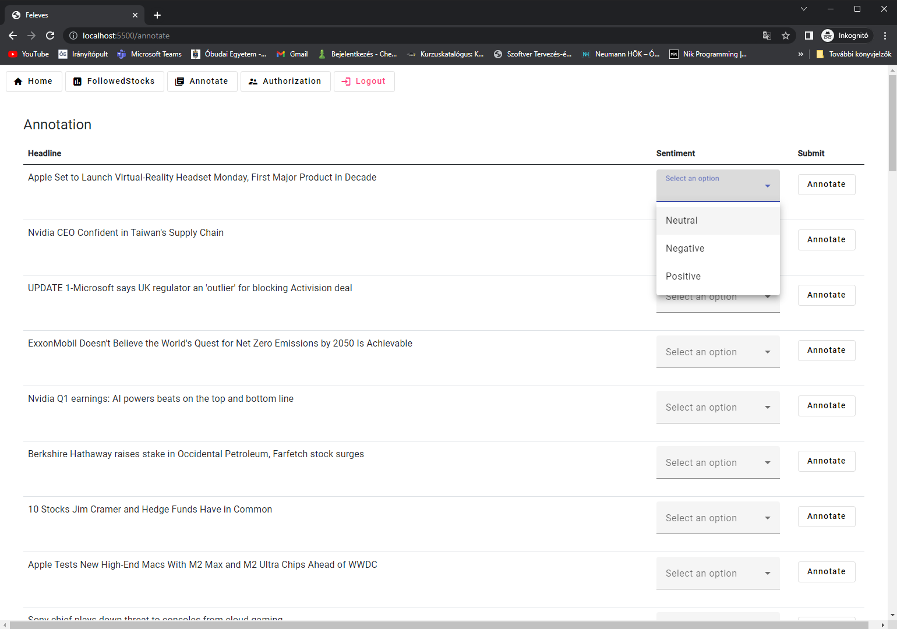
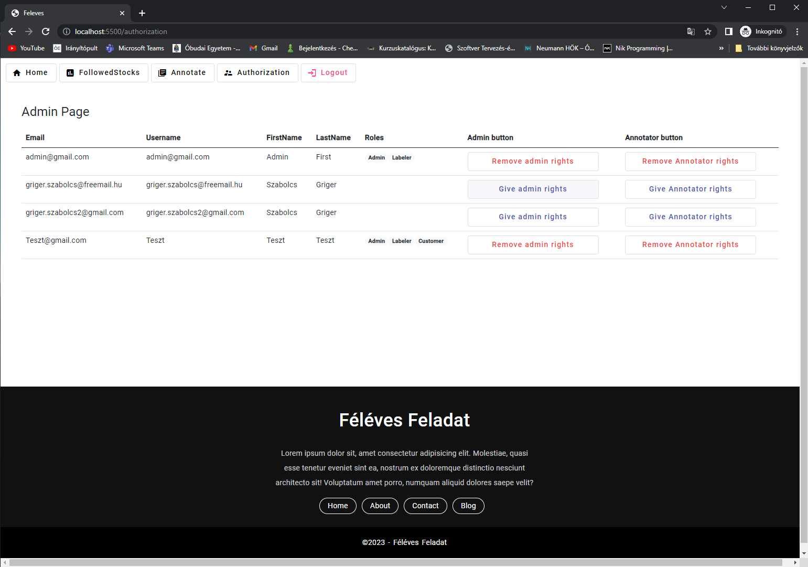

# Féléves Feladat Specifikáció

## Szentiment elemző szoftver pénzügyi hírekhez

### Készítendő rendszer leírása
A rendszer pénzügyi cikkek főcímeit fogja megjeleníteni a felhasználó számára. Ehhez számos weboltalt fog forrásul felhasználni. A főcímre kattintva a felhasználót átnavigálja a megfelelő weboldalra. A felhasználó 'követhet' részvényeket. A bekövetett cégekkel kapcsolatos információk és aktuális cikkek a felhasználó főoldalán jelennek meg.
Az applikációt használva a felhasználó lekérheti, nyomon követheti azokat a cikkeket melyek megemlítik kedvenc részvényeit, böngészhet új befektetési lehetőségek után a hírcsatornák globális véleményei alapján,valamint összesített statisztikákat olvashat részvényekről.
A jogosultsággal rendelkező felhasználók képesek lesznek új tanítómintákat létrehozni, címkézni az ML model számára, hogy az a későbbiekben még pontosabb predikciókat produkáljon.
 
 

### Funkciólista
- Regisztráció , social login
- Backend által szolgáltatott adatok(headline-ok) megjelenítése.
- Follow/unfollow funkció
- Homepage jelenítsen meg aggregált információkat a bekövetett cégek/részvényekről
- Rendelkezzen admin felülettel, az admin adhasson 'labeler' jogosultságot a felhasználóknak
- A labeler joggal rendelkező felhasználóknak címkéző felület. (Create TrainData)
 
 

### Backend végpontlista
- /Article [GET] - adatforrás a kliensnek
- /Annotation - címkézetlen adatokat szolgáltatja [GET] | várja a klienstől az annotált adatokat [POST]
- /LikedStock [GET] - a felhasználó által kedvelt részvényekkel kapcsolatos információkat szolgáltatja 
- /LikedStock [POST] - a felhasználó kedvelt részvényeinek listájához hozzáadja a kérés törzsében elküldött részvényt
- /LikedStock/{stockid} [DELETE] -  az adott id-val rendelkező részvényt eltávolítja a listából
- /Auth/Login [POST] - Bejelentkezés, visszaadja a JWT-t expiration-nal.
- /Auth/InsertUser [PUT] - felhasználó regisztrálása
- /Auth/DeleteMyself [DELETE] - felhasználó törlés
- /Auth/GetUsers [GET] - felhasználók listája
- /Auth/GrantAdmin [POST] - Admin jogot ad a kérés törzsében érkezett azonosítójú felhasználónak
- /Auth/GrantAnnotator [POST] - Annotáló jogot ad a kérés törzsében érkezett azonosítójú felhasználónak
- /Auth/RemoveAdmin [POST]
- /Auth/RemoveAnnotator [POST]
 
 

### Használt technológiák, keretrendszer
A backend elkészítéséhez a Microsoft ASP.NET keretrendszerét, a frontendhez az Angular keretrendszert fogom használni CSS-hez pedig az Angular Material-t
 
 

### Design

#### Login

  
#### Register

  
#### Home

  
#### FollowedStocks

  
#### Annotation

  
#### Authorization

